# Eventify - Event Management Platform (Frontend)


### Live Site
https://eventify-front-e281c9a84c02.herokuapp.com/

## Table of Contents
1. [Introduction](#introduction)
2. [Project Goals](#project-goals)
3. [UX Design](#ux-design)
   - [User Stories](#user-stories)
   - [Wireframes](#wireframes)
   - [Design Choices](#design-choices)
4. [Features](#features)
   - [Existing Features](#existing-features)
   - [Future Features](#future-features)
5. [Authentication System](#authentication-system)
6. [Event Management](#event-management)
7. [Profile & Social Features](#profile--social-features)
8. [Component Architecture](#component-architecture)
9. [Technologies Used](#technologies-used)
10. [Testing](#testing)
    - [Manual Testing](#manual-testing)
    - [Automated Testing](#automated-testing)
    - [Validation](#validation)
11. [Deployment](#deployment)
12. [Credits](#credits)
13. [Backend API](#backend-api)

## Introduction
Eventify is a full-stack event management platform that allows users to create, discover, and register for events. This repository contains the frontend React application that consumes the Eventify Django REST API.

The platform enables users to browse events, create their own events, register for events, and interact with other users through comments, follows, and a favorites system.

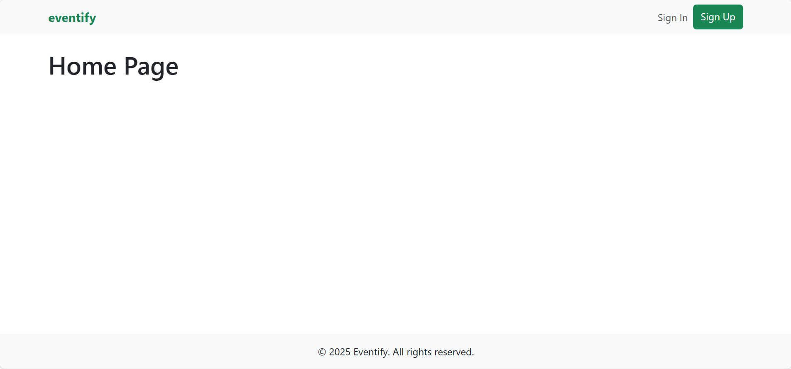

## Project Goals
The main goal of this project is to create a user-friendly event management platform where:
- Users can easily discover events based on various criteria
- Event creators can manage their events effectively
- The platform provides social interaction features
- The interface is intuitive and responsive across all devices

## UX Design

### User Stories
The project is built around addressing specific user needs, represented by the following user stories grouped into epics:

**Authentication & User Profile Epic**
1. As a new user, I want to sign up for an account to access the platform's features
2. As a registered user, I want to log in to my account to access my personalized content
3. As a logged-in user, I want to log out to keep my information secure
4. As a user, I want to view my profile information
5. As a user, I want to edit my profile information
6. As a user, I want to view events I've registered for

**Event Browsing Epic**
7. As a visitor, I want to view a list of upcoming events to discover activities
8. As a visitor, I want to search for events by keywords
9. As a visitor, I want to filter events by category, date, and location
10. As a visitor, I want to view detailed information about an event

**Event Management Epic**
11. As a logged-in user, I want to create a new event
12. As an event creator, I want to edit my event details
13. As an event creator, I want to delete my event
14. As an event creator, I want to view who has registered for my event

**Event Interaction Epic**
15. As a logged-in user, I want to register for an event
16. As a registered attendee, I want to cancel my registration
17. As a logged-in user, I want to favorite events to save them for later
18. As a logged-in user, I want to comment on events

**Social Features Epic**
19. As a user, I want to follow other users to stay updated on their events
20. As a user, I want to see profiles of other users on the platform

### Wireframes

#### Desktop Wireframes
These wireframes were created during the planning phase to visualize the user interface and experience:

1. **Event Creation Form**  
   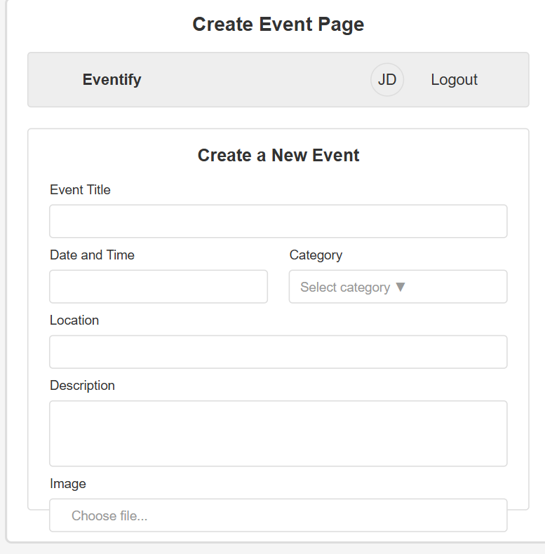

2. **Event Details Page**  
   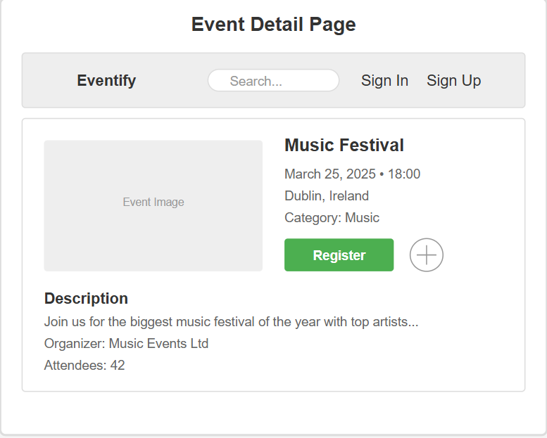

3. **Sign Up & Profile Pages**  
   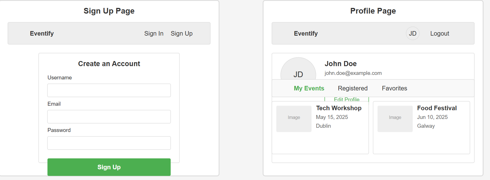

#### Mobile Wireframes
The application is designed to be fully responsive with a mobile-first approach:

1. **Mobile View of Events**  
   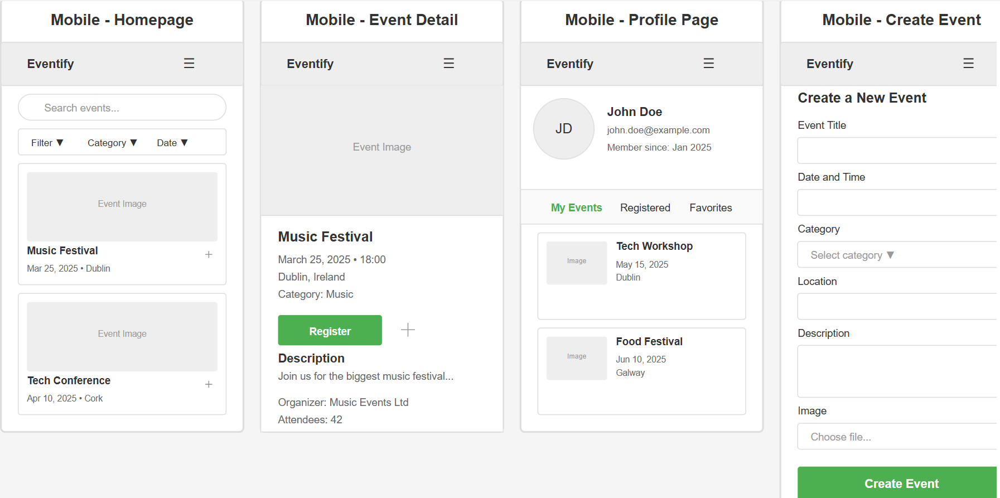

2. **Mobile Search Interface**  
   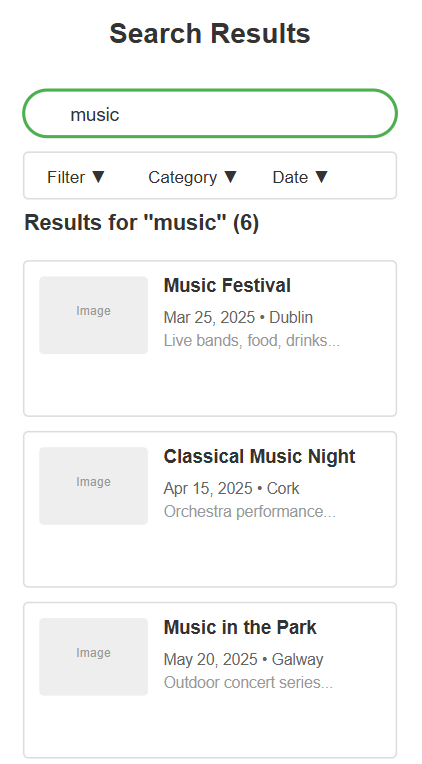

### Design Choices
The design of Eventify emphasizes clarity, usability, and responsive layout to create an intuitive and engaging user experience:

#### Color Scheme
- **Primary Color (Blue #0D6EFD)**: Used for primary buttons, links, and highlighting important actions. Blue was chosen because it conveys trustworthiness and reliability, important qualities for an event platform.
- **Secondary Color (Gray #6C757D)**: Used for secondary buttons and less prominent UI elements. Creates visual hierarchy without distracting from primary actions.
- **Success Color (Green #198754)**: Used for success messages and confirmations, such as successful event creation or registration.
- **Warning Color (Yellow #FFC107)**: Used sparingly for warnings or important notices that require attention but are not critical errors.
- **Danger Color (Red #DC3545)**: Used for error messages, delete actions, and critical warnings. The high-contrast red immediately draws user attention to potential issues.
- **Light Background (White/Light Gray)**: Creates a clean, modern look that improves readability and reduces eye strain during extended use.

#### Typography
- **Primary Font (System UI)**: Using system fonts improves performance and ensures text looks native on all devices.
- **Font Sizes**: Carefully selected to maintain readability across all device sizes:
  - Headings: Bold, larger sizes (1.25-2.5rem) for clear content hierarchy
  - Body Text: 1rem (16px) for optimal readability
  - Small Text: 0.875rem for secondary information
- **Line Height**: Set at 1.5 for body text to improve readability for longer content descriptions

#### Layout
- **Card-Based Design**: Events are displayed in consistent cards that provide all essential information at a glance, with clear visual hierarchy.
- **Grid System**: Bootstrap's responsive grid system ensures consistent spacing and alignment of elements.
- **Whitespace**: Liberal use of whitespace between elements reduces visual clutter and improves focus on important content.
- **Content Hierarchy**: Information is presented in order of importance, with critical details (event title, date, location) more prominent than secondary details.

#### Navigation
- **Fixed Navigation Bar**: Always accessible at the top of the screen for easy navigation between sections.
- **Clear Labeling**: Descriptive labels with icons for improved recognition and accessibility.
- **Mobile Navigation**: Collapses into a hamburger menu on smaller screens to maximize content space.

#### Responsive Design
- **Mobile-First Approach**: Designed initially for mobile devices, then progressively enhanced for larger screens.
- **Breakpoints**: Strategic breakpoints at 576px, 768px, 992px, and 1200px to optimize layout across device sizes.
- **Flexible Images**: Images resize proportionally to fit different screen sizes without distortion.
- **Touch-Friendly UI**: Large touch targets (minimum 44x44px) for buttons and interactive elements on mobile devices.

#### User Interface Elements
- **Buttons**: Clear visual distinction between primary, secondary, and tertiary actions.
- **Forms**: Consistent styling with clear validation feedback and helper text.
- **Loading States**: Skeleton screens and spinners to indicate when content is loading.
- **Feedback Messages**: Toast notifications for user actions with appropriate colors for different message types.

These design decisions were made specifically to support the user stories and provide the best possible experience for event creators and attendees.

## Features

### Existing Features
- **User Authentication**
  - Sign up, sign in, and sign out functionality
  - Protected routes for authenticated users
  - Form validation to ensure data integrity

  
  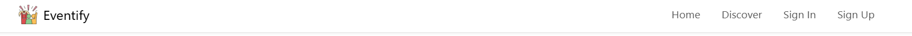

- **Event Management**
  - Create events with details like title, description, date, location, category, and cover image
  - Edit and delete events
  - View event attendees

  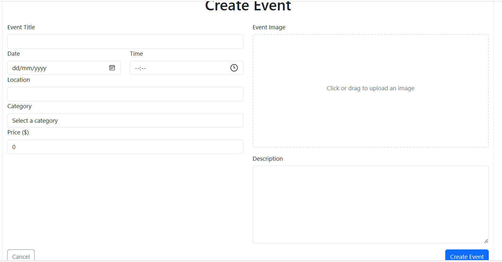
  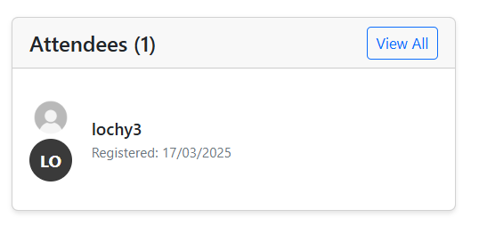

- **Event Discovery**
  - Browse all events
  - Search events by keywords
  - Filter events by category

  

- **Event Interaction**
  - Register for events
  - Cancel event registration
  - Favorite events for later reference
  - Comment on events

  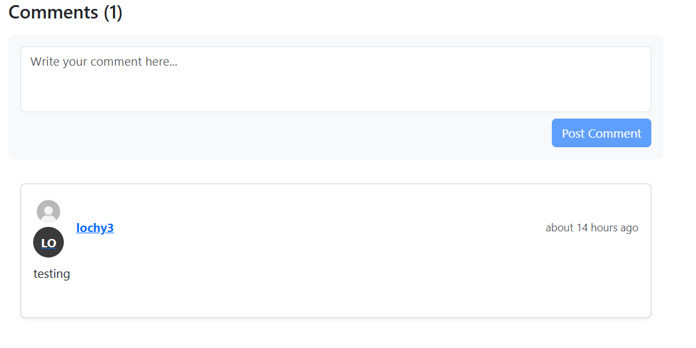

- **User Profiles**
  - View and edit personal profile
  - Follow other users
  - See events created by a user
  - See events a user is attending
  - See events a user has favorited

  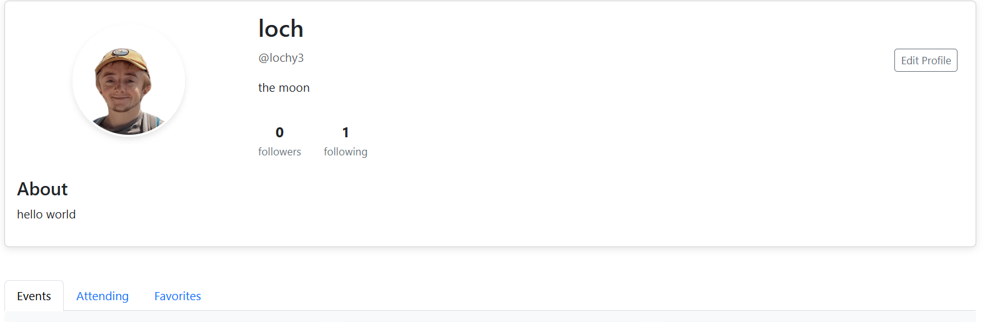
  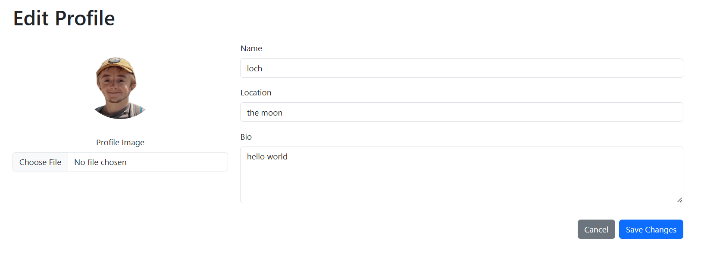

- **Social Features**
  - Follow/unfollow other users
  - Browse users on the platform
  - Search for users by name or username

  

### Future Features
- Advanced filtering and sorting options for events
- Event categories and tags
- Event sharing to social media
- Email notifications for event updates
- Calendar integration
- Event ratings and reviews
- Image gallery for events
- Real-time chat for event attendees

## Authentication System

Eventify implements a secure token-based authentication system leveraging Django's authentication on the backend with a custom React implementation on the frontend.

### Authentication Flow

1. **User Registration (Sign Up)**
   - The registration process begins when a user submits the SignUpForm component
   - Form validation occurs on both client and server sides
   - Upon successful registration, the user is redirected to the login page

2. **User Login**
   - Users enter their credentials in the SignInForm component
   - Upon successful authentication, the server returns an authentication token
   - The token is stored in localStorage along with basic user information
   - The CurrentUserContext is updated to reflect the logged-in state

3. **Authentication State Management**
   - The application uses React's Context API to manage authentication state
   - The CurrentUserContext provides the current user's information to all components
   - Components can access the current user and authentication status using the useCurrentUser hook
   - Protected routes check this context to determine if a user can access certain pages

4. **Logout**
   - When a user logs out, the token is removed from localStorage
   - The user context is cleared
   - The user is redirected to the home page

## Event Management

Eventify offers comprehensive event management features that allow users to create, discover, and participate in events.

### Event Creation and Editing

Users can create and manage their own events with detailed information:

1. **Create Events**
   - Title, description, date, location, category, and price
   - Upload event cover images
   - User-friendly form with validation

2. **Edit Events**
   - Update any event details
   - Change event cover images
   - Only the event creator can edit an event

3. **Delete Events**
   - Remove events that are no longer taking place
   - Confirmation dialog to prevent accidental deletion

### Event Discovery

Eventify makes it easy for users to find events of interest:

1. **Browse Events**
   - View all upcoming events in a responsive grid layout
   - Events are displayed as cards with key information

2. **Search and Filter**
   - Search events by keywords
   - Filter by category (music, tech, sports, arts, food, etc.)
   - Special filters for personalized views:
     - `/events` - All events
     - `/myevents` - Events created by the current user
     - `/attending` - Events the user is registered for
     - `/favorites` - Events the user has favorited

### Event Interaction

Users can interact with events in several ways:

1. **Event Registration**
   - Register to attend events with a single click
   - Cancel registration if plans change
   - View events you're registered for in your profile

2. **Favorites**
   - Save events to your favorites list for later
   - Easily access favorited events from your profile

3. **Comments**
   - Comment on events to ask questions or provide feedback
   - Edit or delete your own comments

## Profile & Social Features

Eventify includes robust user profiles and social interaction features, enabling users to connect and follow each other.

### User Profiles

User profiles in Eventify provide a centralized place for users to:

1. **Display Personal Information**
   - Customizable profile picture (avatar)
   - User bio and location
   - Username and registration date

2. **Track Activity**
   - Events created by the user
   - Events the user is attending
   - Events the user has favorited

3. **Manage Social Connections**
   - View followers (people following this user)
   - View following (people this user follows)

### Follow System

The follow system allows users to connect with each other and stay updated on their activities:

1. **Follow Functionality**
   - Users can follow other users by clicking the "Follow" button on profiles
   - Following creates a relationship in the database through the `/followers/` API endpoint
   - The follow button toggles between "Follow" and "Following" states based on the relationship status

2. **Follower/Following Counts**
   - Each profile displays accurate counts of followers and following

### People Page

The platform includes a dedicated People page that:

1. **Displays User Profiles**
   - Shows all users except the currently logged-in user
   - Presents basic profile information in card format

2. **Provides Search Functionality**
   - Users can search for others by username, display name, or location
   - Search is performed client-side for instant results

## Component Architecture
Eventify's frontend is built using a component-based architecture with a clear separation of concerns and an emphasis on reusable components. The project structure is organized as follows:

```
eventify-frontend/
│── public/                         
│   ├── index.html                   
│   ├── favicon.ico                  
│   └── images/                      
│
│── src/                            
│   ├── components/                  
│   │   ├── auth/                    
│   │   ├── comments/                 
│   │   │   ├── Comment.js            
│   │   │   ├── CommentList.js        
│   │   │   ├── CommentForm.js        
│   │   │   └── index.js         
│   │   ├── events/                  
│   │   │   ├── EventAttendButton.js          
│   │   │   ├── EventCard.js          
│   │   │   ├── EventDetail.js        
│   │   │   ├── EventForm.js          
│   │   │   ├── EventList.js          
│   │   │   └── index.js         
│   │   ├── favorites/               
│   │   │   ├── FavoriteButton.js     
│   │   │   └── index.js      
│   │   ├── profiles/                 
│   │   │   ├── Profile.js            
│   │   │   ├── ProfileCard.js        
│   │   │   └── index.js      
│   │   └── common/                  
│   │       ├── Asset.js             
│   │       ├── Avatar.js             
│   │       ├── Footer.js             
│   │       ├── NavBar.js             
│   │       └── index.js            
│   ├── pages/                      
│   │   ├── auth/                     
│   │   │   ├── SignInForm.js         
│   │   │   ├── SignUpForm.js         
│   │   │   └── index.js
│   │   ├── events/                   
│   │   │   ├── EventCreatePage.js    
│   │   │   ├── EventDetailPage.js    
│   │   │   ├── EventEditPage.js      
│   │   │   ├── EventsPage.js         
│   │   │   ├── EventAttendeesPage.js 
│   │   │   └── index.js
│   │   ├── ProfilePage.js            
│   │   ├── ProfileEditForm.js        
│   │   └── PeoplePage.js                      
│   │
│   ├── contexts/                    
│   │   └── CurrentUserContext.js    
│   │
│   ├── hooks/                       
│   │   ├── useClickOutsideToggle.js 
│   │   └── useRedirect.js            
│   │
│   ├── api/                    
│   │   └── axiosDefaults.js         
│   │
│   ├── styles/                      
│   │   ├── Asset.module.css
│   │   ├── AuthForms.module.css
│   │   ├── Avatar.module.css
│   │   ├── Comment.module.css
│   │   ├── CommentForm.module.css
│   │   ├── CommentList.module.css
│   │   ├── EventCard.module.css
│   │   ├── EventForm.module.css
│   │   ├── EventList.module.css
│   │   ├── NavBar.module.css         
│   │   ├── Profile.module.css        
│   │   ├── ProfileCard.module.css    
│   │   └── ProfilePage.module.css    
│   │
│   ├── utils/                       
│   │   └── utils.js                  
│   │
│   ├── App.js                       
│   └── index.js                   
│
├── .env                             
├── .gitignore                       
├── package.json                     
└── README.md                        
```

### Component Organization

The project follows best practices for React component organization:

1. **Component-Based Architecture**
   - Components are organized by feature domain (events, comments, profiles, etc.)
   - Each component has a single responsibility
   - Reusable components are placed in the common directory

2. **Modular Imports with Index Files**
   - Index.js files are used for clean exports from component directories
   - This simplifies imports and makes component relocation easier

3. **Separation of Concerns**
   - UI components are separate from pages
   - API logic is centralized in the api directory
   - CSS is modularized with CSS modules

### Reusable Components

The application makes extensive use of reusable components to maintain consistency and reduce code duplication:

1. **Common UI Components**
   - `Avatar` - Displays user profile images with consistent styling
   - `Asset` - Handles loading states and fallback images throughout the app
   - `NavBar` - Consistent navigation across all pages with responsive design
   - `Footer` - Standard footer with consistent styling

2. **Event Components**
   - `EventCard` - Reusable card component for displaying event preview information
   - `EventAttendButton` - Button component for registering/unregistering for events
   - `EventList` - Component for displaying lists of events with consistent styling

3. **Interactive Components**
   - `CommentForm` - Reusable form for adding comments
   - `Comment` - Standardized display of comments with edit/delete functionality
   - `FavoriteButton` - Toggle button for favoriting events
   - `ProfileCard` - Standardized display of user profile information

These reusable components maintain consistent design language throughout the application and significantly improve development efficiency by avoiding code duplication.

## Technologies Used

### Languages
- HTML5
- CSS3
- JavaScript (ES6+)

### Frameworks & Libraries
- **React.js** - Frontend library for building the user interface. Chosen for its component-based architecture which allows for efficient UI development and state management.
- **React Router** - For handling navigation and routing in a single-page application. Provides a clean way to handle navigation without page reloads.
- **React Bootstrap** - UI component library that provides pre-styled components with responsive design. Speeds up development and ensures consistency.
- **Axios** - For making HTTP requests to the API. Offers a simple API, good error handling, and automatic JSON transformation.
- **Date-fns** - For date formatting and manipulation. A lightweight alternative to Moment.js with better tree-shaking support.
- **JWT Decode** - For securely decoding JWT tokens. Essential for handling authentication.
- **Formik** - For form handling with validation. Simplifies the process of building, validating, and submitting forms.
- **Yup** - Schema validation library that works well with Formik for form validation.
- **React Toastify** - For displaying toast notifications to users. Provides a clean, user-friendly way to show feedback.

### Development Tools
- Git & GitHub - Version control and code repository
- npm - Package manager
- VS Code - Code editor
- ESLint - For code quality and validation

### Development Approach
- **Agile Methodology** - The project was developed using Agile principles with the following elements:
  - User stories organized into epics for a clear development roadmap
  - GitHub Projects for tracking tasks and issues
  - Iterative development approach with regular reviews
  - User-centric design decisions based on the user stories

## Testing

### Problem-Solving Example

During development, a significant issue was encountered and resolved with event filtering:

**Problem**: The favorites and attending filters weren't working correctly. When users tried to view their favorited events, the application would show all events instead of just the ones they had favorited.

**Solution**: Updated the backend EventList view with a custom `get_queryset` method that properly handles the `favorite=true` and `attending=true` filter parameters. Also simplified the frontend filter string to match what the backend expected.

**Result**: Users can now correctly view only their favorited events and events they're attending, enhancing the personalized experience of the application.

### Manual Testing
Comprehensive manual testing was performed on all features to ensure proper functionality and user experience.

#### User Authentication Testing

| Test Case | Steps | Expected Result | Status |
|-----------|-------|-----------------|--------|
| User Registration | 1. Navigate to Sign Up page<br>2. Enter valid username, email, password<br>3. Submit form | User is created and redirected to sign in page with success message | ✅ |
| Registration Validation | 1. Navigate to Sign Up page<br>2. Enter invalid data (e.g., short password)<br>3. Submit form | Form shows validation errors and prevents submission | ✅ |
| User Login | 1. Navigate to Sign In page<br>2. Enter valid credentials<br>3. Submit form | User is authenticated and redirected to home page | ✅ |
| Login Validation | 1. Navigate to Sign In page<br>2. Enter invalid credentials<br>3. Submit form | Error message displayed, form not submitted | ✅ |
| User Logout | 1. Click logout button when signed in | User is logged out and redirected to home page | ✅ |
| Protected Route Access | 1. Try to access protected route (e.g., /events/create) when not logged in | User is redirected to login page | ✅ |
| Authentication Persistence | 1. Log in<br>2. Refresh the page | User remains logged in | ✅ |

#### Event Management Testing

| Test Case | Steps | Expected Result | Status |
|-----------|-------|-----------------|--------|
| View Events List | 1. Navigate to Events page | Events are displayed in grid/list format with images and key details | ✅ |
| Event Pagination | 1. Navigate to Events page with many events | Events are paginated with working next/previous buttons | ✅ |
| Event Search | 1. Enter search term in search bar<br>2. Submit search | Events matching search term are displayed | ✅ |
| Event Filtering | 1. Select category filter<br>2. Apply filter | Only events in selected category are displayed | ✅ |
| Event Detail View | 1. Click on an event card | Event detail page shows all information about the event | ✅ |
| Create Event | 1. Navigate to Create Event page<br>2. Fill in all fields<br>3. Upload image<br>4. Submit form | Event is created and displayed in events list and user's profile | ✅ |
| Create Event Validation | 1. Navigate to Create Event page<br>2. Submit form with missing required fields | Form validation errors displayed, submission prevented | ✅ |
| Edit Event | 1. Navigate to event created by logged-in user<br>2. Click Edit button<br>3. Modify fields<br>4. Submit form | Event is updated with new information | ✅ |
| Delete Event | 1. Navigate to event created by logged-in user<br>2. Click Delete button<br>3. Confirm deletion | Event is removed from events list | ✅ |

#### Event Interaction Testing

| Test Case | Steps | Expected Result | Status |
|-----------|-------|-----------------|--------|
| Register for Event | 1. Navigate to event detail<br>2. Click Attend/Register button | User is registered for event and button changes state | ✅ |
| Cancel Registration | 1. Navigate to event user is registered for<br>2. Click Cancel Registration button | User's registration is removed and button changes state | ✅ |
| Favorite Event | 1. Navigate to event<br>2. Click Favorite button | Event is added to user's favorites and button changes state | ✅ |
| Unfavorite Event | 1. Navigate to event user has favorited<br>2. Click Favorite button again | Event is removed from user's favorites and button changes state | ✅ |
| Add Comment | 1. Navigate to event detail<br>2. Enter comment text<br>3. Submit comment | Comment appears in comment list with user information | ✅ |
| Edit Comment | 1. Navigate to event with user's comment<br>2. Click Edit<br>3. Modify text<br>4. Submit | Comment is updated with new text | ✅ |
| Delete Comment | 1. Navigate to event with user's comment<br>2. Click Delete<br>3. Confirm deletion | Comment is removed from comment list | ✅ |

#### Profile & Social Features Testing

| Test Case | Steps | Expected Result | Status |
|-----------|-------|-----------------|--------|
| View Profile | 1. Click on username or navigate to profile URL | User profile is displayed with correct information | ✅ |
| Edit Profile | 1. Navigate to own profile<br>2. Click Edit Profile<br>3. Modify fields<br>4. Submit form | Profile is updated with new information | ✅ |
| Upload Profile Picture | 1. Navigate to Edit Profile<br>2. Select image file<br>3. Submit form | Profile picture is updated | ✅ |
| Follow User | 1. Navigate to another user's profile<br>2. Click Follow button | User is followed and button changes to "Following" | ✅ |
| Unfollow User | 1. Navigate to profile of user being followed<br>2. Click "Following" button | User is unfollowed and button changes to "Follow" | ✅ |
| View Following/Followers | 1. Navigate to profile<br>2. Click on Followers/Following count | List of followers/following users is displayed | ✅ |
| View Events by User | 1. Navigate to user profile | Events created by user are displayed | ✅ |
| View Attending Events | 1. Navigate to own profile<br>2. Go to Attending tab | Events user is registered for are displayed | ✅ |
| View Favorite Events | 1. Navigate to own profile<br>2. Go to Favorites tab | Events user has favorited are displayed | ✅ |

#### Responsive Design Testing

| Test Case | Steps | Expected Result | Status |
|-----------|-------|-----------------|--------|
| Desktop Layout | 1. Open application on desktop (>1024px)<br>2. Navigate through main pages | All elements are properly aligned and sized for desktop | ✅ |
| Tablet Layout | 1. Open application on tablet (768px-1024px)<br>2. Navigate through main pages | Layout adjusts for medium screens with appropriate sizing | ✅ |
| Mobile Layout | 1. Open application on mobile (<768px)<br>2. Navigate through main pages | Single-column layout, hamburger menu appears, elements stack vertically | ✅ |
| Navigation Menu (Mobile) | 1. View on mobile device<br>2. Click hamburger icon<br>3. Test navigation links | Menu opens/closes correctly, links function properly | ✅ |
| Image Responsiveness | 1. View event images on different devices | Images resize appropriately without distortion | ✅ |
| Form Responsiveness | 1. Open forms on different devices<br>2. Test input fields | Forms adjust to screen width, inputs are usable on touch devices | ✅ |


#### Error Handling & Feedback Testing

| Test Case | Steps | Expected Result | Status |
|-----------|-------|-----------------|--------|
| Form Validation Feedback | 1. Submit forms with invalid data | Appropriate error messages appear with clear instructions | ✅ |
| API Error Handling | 1. Simulate API errors (e.g., disconnect internet)<br>2. Attempt operations | User-friendly error messages appear, app doesn't crash | ✅ |
| Loading States | 1. Navigate between pages<br>2. Submit forms<br>3. Load data-heavy pages | Loading indicators appear during data fetching operations | ✅ |
| Success Feedback | 1. Perform successful operations (create/edit/delete)<br>2. Submit forms successfully | Success messages appear to confirm actions | ✅ |
| 404 Page | 1. Navigate to non-existent URL | Custom 404 page appears with navigation back to valid pages | ✅ |

#### Cross-Browser Testing

| Browser | Version | Functionality | Appearance |
|---------|---------|--------------|------------|
| Chrome | Latest | ✅ | ✅ |
| Firefox | Latest | ✅ | ✅ |
| Safari | Latest | ✅ | ✅ |
| Edge | Latest | ✅ | ✅ |


### Automated Testing
Basic automated tests were implemented for key components to demonstrate testing approach:

```javascript
// Example test for EventCard component
import React from 'react';
import { render, screen } from '@testing-library/react';
import '@testing-library/jest-dom';

// Mock EventCard component for testing purposes
const MockEventCard = () => {
  return <div>Event Card Component</div>;
};

// Simple test to document testing approach
describe('EventCard component', () => {
  test('renders the component', () => {
    render(<MockEventCard />);
    expect(screen.getByText('Event Card Component')).toBeInTheDocument();
  });
});
```

### Validation

Code quality and validation were important priorities for this project:

- **ESLint for JavaScript/JSX validation**
  - Custom ESLint configuration to ensure code quality
  - Fixed all significant issues affecting functionality
  - Added PropTypes for all components to document expected props
  - Resolved unused variables and imports
  - Custom rules to allow certain patterns common in React development

  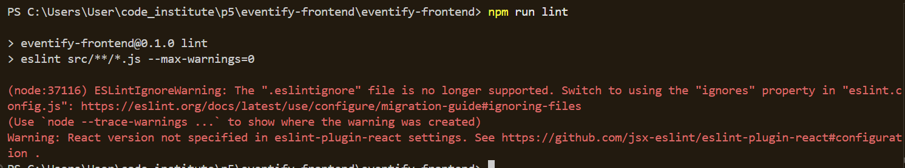

- **Test Results**
  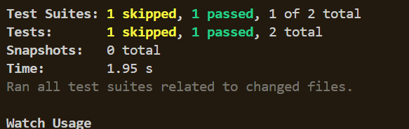

- **Responsive Design Testing**
  - Tested on multiple device sizes to ensure responsive layout
  - Bootstrap breakpoints used consistently

- **Cross-Browser Testing**
  - Tested on Chrome, Firefox, and Safari
  - Ensured consistent behavior across browsers

## Deployment

The frontend application is deployed on Heroku, a cloud platform that enables developers to build, run, and operate applications entirely in the cloud. You can access the live application at [https://eventify-react-ff1e525f1dc0.herokuapp.com/](https://eventify-react-ff1e525f1dc0.herokuapp.com/).

### Deployment Process

#### Prerequisites
- GitHub account connected to Heroku
- Heroku CLI installed (optional, but helpful for troubleshooting)
- Node.js and npm installed locally

#### Preparing the Application for Deployment

1. **Create Production Build**
   - The application uses the following script in package.json to create a production build:
     ```
     "build": "CI=false react-scripts build"
     ```
   - Setting `CI=false` prevents the build from failing on warnings

2. **Configure Server for Production**
   - Created `server.js` in the root directory to serve the production build:
     ```javascript
     const express = require('express');
     const path = require('path');
     const app = express();
     const PORT = process.env.PORT || 3000;

     // Serve static files from the React build
     app.use(express.static(path.join(__dirname, 'build')));

     // All other requests get sent to the React app
     app.get('*', (req, res) => {
       res.sendFile(path.join(__dirname, 'build', 'index.html'));
     });

     app.listen(PORT, () => {
       console.log(`Server is running on port ${PORT}`);
     });
     ```

3. **Configure start script**
   - Updated the `start` script in package.json to use the server in production:
     ```
     "start": "node server.js"
     ```

4. **Configure Necessary Files**
   - Created `static.json` for routing configuration:
     ```json
     {
       "root": "build/",
       "routes": {
         "/**": "index.html"
       }
     }
     ```
   - Added Node.js and npm versions to package.json:
     ```json
     "engines": {
       "node": "16.x",
       "npm": "8.x"
     }
     ```

#### Deploying to Heroku

1. **Create a Heroku Application**
   - Logged in to Heroku Dashboard and created a new app named "eventify-react"
   - Selected the appropriate region (Europe)

2. **Connect to GitHub**
   - In the Heroku Dashboard, went to the "Deploy" tab
   - Selected GitHub as the deployment method
   - Connected to the GitHub repository

3. **Configure Environment Variables**
   - In the "Settings" tab, added the following config vars:
     - `REACT_APP_API_URL`: URL to the deployed backend API (https://eventify-back-d016873ba1b8.herokuapp.com/api)
     - `REACT_APP_CLOUDINARY_CLOUD_NAME`: Cloudinary cloud name for image uploads

4. **Deploy the Application**
   - Enabled automatic deploys from the main branch
   - Performed initial manual deploy by clicking "Deploy Branch"

5. **Verify Deployment**
   - Monitored the build logs for any errors
   - Once deployment was complete, opened the app to verify it was working correctly
   - Tested authentication, event creation, and other core features in the production environment

### Local Deployment

1. Clone this repository:
   ```
   git clone https://github.com/yourusername/eventify-frontend.git
   ```

2. Navigate to the project directory:
   ```
   cd eventify-frontend
   ```

3. Install dependencies:
   ```
   npm install
   ```

4. Create a `.env` file in the root directory with the following variables:
   ```
   REACT_APP_API_URL=http://localhost:8000/api
   REACT_APP_CLOUDINARY_CLOUD_NAME=your_cloudinary_cloud_name
   ```

5. Start the development server:
   ```
   npm run dev
   ```

6. The application should now be running on http://localhost:3000

### Deployment Updates

When making changes to the deployed application:

1. Push changes to the GitHub repository
2. If automatic deploys are enabled, Heroku will automatically build and deploy the updated application
3. If not, manually deploy from the Heroku Dashboard
4. Monitor the build logs for any errors
5. Verify the changes are working as expected in the production environment

## Credits
- React Bootstrap for UI components
- Font Awesome for icons
- https://github.com/hannahro15/CI-Feb25-hackathon. Was part of this team, where my main role was creating the models, views and serialzers for the events app.
- Onlook-setup to create wireframes
- chatgpt for problem shooting erros when I got stuck
- Cloudinary for image hosting
- Various npm packages listed in package.json
- Code Institute for project inspiration and guidance

## Backend API
The frontend application consumes data from the Eventify Django REST API.
For more information about the backend, please visit the backend repository:
https://github.com/KWSNick/eventify-django

The backend API is deployed at [https://eventify-back-d016873ba1b8.herokuapp.com/api](https://eventify-back-d016873ba1b8.herokuapp.com/api)

The backend API provides the following main endpoints:

- `/auth/` - Authentication endpoints (login, register, token refresh)
- `/events/` - Create, read, update, and delete events
- `/profiles/` - User profile management
- `/comments/` - Event comments
- `/attendees/` - Event registrations
- `/favorites/` - User event favorites
- `/followers/` - User following relationships
