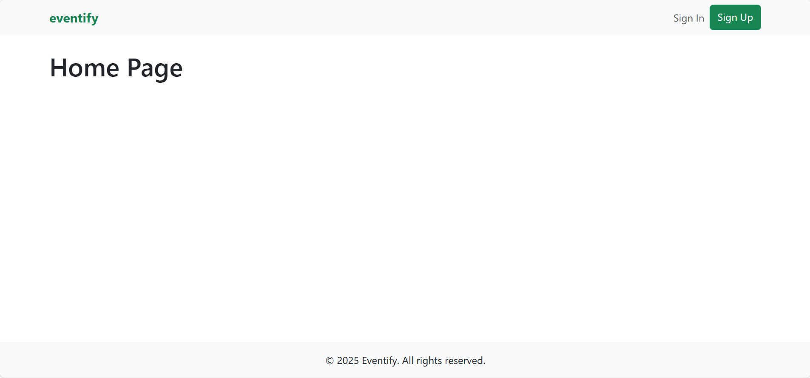

# Eventify - Event Management Platform (Frontend)



## Table of Contents
1. [Introduction](#introduction)
2. [Project Goals](#project-goals)
3. [UX Design](#ux-design)
   - [User Stories](#user-stories)
   - [Wireframes](#wireframes)
   - [Design Choices](#design-choices)
4. [Features](#features)
   - [Existing Features](#existing-features)
   - [Future Features](#future-features)
5. [Component Architecture](#component-architecture)
6. [Technologies Used](#technologies-used)
7. [Testing](#testing)
   - [Manual Testing](#manual-testing)
   - [Automated Testing](#automated-testing)
   - [Validation](#validation)
8. [Deployment](#deployment)
9. [Credits](#credits)
10. [Backend API](#backend-api)

## Introduction
Eventify is a full-stack event management platform that allows users to create, discover, and register for events. This repository contains the frontend React application that consumes the Eventify Django REST API.

The platform enables users to browse events, create their own events, register for events, and interact with other users through comments and a favorites system.

## Project Goals
The main goal of this project is to create a user-friendly event management platform where:
- Users can easily discover events based on various criteria
- Event creators can manage their events effectively
- The platform provides social interaction features
- The interface is intuitive and responsive across all devices

## UX Design
(This section will contain wireframes, mockups, and UX design documentation)

### User Stories
The project is built around addressing specific user needs, represented by the following user stories:

(User stories to be added here)

### Wireframes
(Wireframes to be added here)

### Design Choices
(Design choices to be added here)

## Features

### Existing Features
- User authentication (signup, login, logout)
- Event browsing with search and filtering
- Event creation and management
- Event registration
- User profiles
- Favorites functionality
- Comments on events
- Responsive design

### Future Features
(Future features to be added here)

## Component Architecture
Eventify's frontend is built using a component-based architecture with the following structure:

```
eventify-frontend/
│── public/                         
│   ├── index.html                   
│   ├── favicon.ico                  
│   └── images/                      
│
│── src/                            
│   ├── components/                  
│   │   ├── auth/                    
│   │   │   ├── SignInForm.js         
│   │   │   └── SignUpForm.js         
│   │   ├── events/                  
│   │   │   ├── EventCard.js          
│   │   │   ├── EventList.js          
│   │   │   ├── EventForm.js          
│   │   │   ├── EventDetail.js        
│   │   │   ├── EventFilter.js        
│   │   │   └── LikeButton.js         
│   │   ├── comments/                 
│   │   │   ├── Comment.js            
│   │   │   ├── CommentList.js        
│   │   │   └── CommentForm.js        
│   │   ├── favorites/               
│   │   │   ├── FavoriteButton.js     
│   │   │   └── FavoritesList.js      
│   │   ├── profiles/                 
│   │   │   ├── ProfileHeader.js      
│   │   │   └── ProfileEvents.js      
│   │   └── common/                  
│   │       ├── Navbar.js             
│   │       ├── Footer.js             
│   │       ├── Spinner.js            
│   │       ├── Alert.js              
│   │       └── Avatar.js             
│   ├── pages/                      
│   │   ├── HomePage.js               
│   │   ├── EventDetailPage.js        
│   │   ├── EventCreatePage.js        
│   │   ├── EventEditPage.js          
│   │   ├── ProfilePage.js            
│   │   ├── SignInPage.js             
│   │   ├── SignUpPage.js             
│   │   └── NotFoundPage.js           
│   │
│   ├── contexts/                    
│   │   ├── AuthContext.js            
│   │   ├── CurrentUserContext.js    
│   │   └── AlertContext.js           
│   │
│   ├── hooks/                       
│   │   ├── useAuth.js                
│   │   ├── useEvents.js              
│   │   ├── useComments.js            
│   │   └── useFavorites.js           
│   │
│   ├── services/                    
│   │   ├── api.js                    
│   │   ├── authService.js            
│   │   ├── eventService.js           
│   │   ├── commentService.js         
│   │   ├── favoriteService.js        
│   │   └── profileService.js         
│   │
│   ├── styles/                      
│   │   ├── App.css                   
│   │   ├── bootstrap-custom.scss     
│   │   └── variables.scss            
│   │
│   ├── utils/                       
│   │   ├── helpers.js                
│   │   ├── formatters.js             
│   │   ├── validators.js             
│   │   └── constants.js              
│   │
│   ├── App.js                       
│   ├── index.js                   
│   └── routes.js                    
│
├── .env                             
├── .gitignore                       
├── package.json                     
└── README.md                        
```

## Technologies Used

### Languages
- HTML5
- CSS3
- JavaScript (ES6+)

### Frameworks & Libraries
- React.js
- React Router (`npm install react-router-dom`)
- React Bootstrap (`npm install bootstrap react-bootstrap`)
- Axios (`npm install axios`)
- JWT Decode (`npm install jwt-decode`)
- Optional utilities:
  - Formik & Yup (`npm install formik yup`) - For form handling and validation
  - date-fns (`npm install date-fns`) - For date formatting

### Development Tools
- Git & GitHub
- npm
- ESLint
- Prettier

## Authentication Implementation
Initially, the project was set up to use JWT authentication, but during development, I encountered issues with token management and CSRF protection. I decided to switch to Django's session-based authentication with CSRF tokens for better security and simpler implementation.

Key authentication challenges and solutions:
- Implemented proper CSRF token handling in API requests
- Set up secure cookie management for authentication
- Created protected routes for authenticated users

## Testing

### Manual Testing
(Manual testing procedures and results to be added here)

### Automated Testing
(Automated testing information to be added here)

### Validation
(Validation details to be added here)

## Deployment
This section details the steps needed to deploy the Eventify frontend.

### Prerequisites
- Node.js (v16+)
- npm

### Local Deployment
1. Clone this repository:
   ```
   git clone https://github.com/your-username/eventify-frontend.git
   ```
2. Navigate to the project directory:
   ```
   cd eventify-frontend
   ```
3. Install dependencies:
   ```
   npm install
   ```
4. Create a `.env` file in the root directory with the following variables:
   ```
   REACT_APP_API_URL=http://localhost:8000
   ```
5. Start the development server:
   ```
   npm start
   ```
6. The application should now be running on http://localhost:3000

### Production Deployment
(Production deployment instructions to be added here)

## Credits
(Credits and acknowledgments to be added here)

## Backend API
The frontend application consumes data from the Eventify Django REST API. For more information about the backend, please visit the backend repository.
