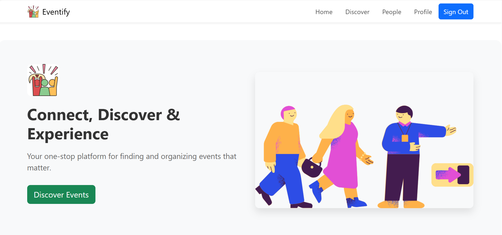
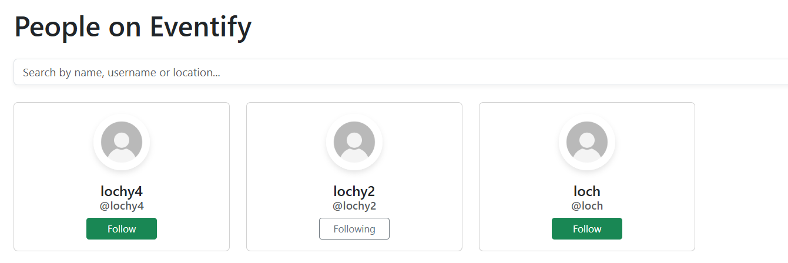

# Eventify - Event Management Platform (Frontend)

## Table of Contents
1. [Introduction](#introduction)
2. [Project Goals](#project-goals)
3. [UX Design](#ux-design)
   - [User Stories](#user-stories)
   - [Wireframes](#wireframes)
   - [Design Choices](#design-choices)
4. [Features](#features)
   - [Existing Features](#existing-features)
   - [Future Features](#future-features)
5. [Authentication System](#authentication-system)
6. [Event Management](#event-management)
7. [Profile & Social Features](#profile--social-features)
8. [Component Architecture](#component-architecture)
9. [Technologies Used](#technologies-used)
10. [Testing](#testing)
    - [Manual Testing](#manual-testing)
    - [Automated Testing](#automated-testing)
    - [Validation](#validation)
11. [Deployment](#deployment)
12. [Credits](#credits)
13. [Backend API](#backend-api)

## Introduction
Eventify is a full-stack event management platform that allows users to create, discover, and register for events. This repository contains the frontend React application that consumes the Eventify Django REST API.

The platform enables users to browse events, create their own events, register for events, and interact with other users through comments, follows, and a favorites system.



## Project Goals
The main goal of this project is to create a user-friendly event management platform where:
- Users can easily discover events based on various criteria
- Event creators can manage their events effectively
- The platform provides social interaction features
- The interface is intuitive and responsive across all devices

## UX Design

### User Stories
The project is built around addressing specific user needs, represented by the following user stories grouped into epics:

**Authentication & User Profile Epic**
1. As a new user, I want to sign up for an account to access the platform's features
2. As a registered user, I want to log in to my account to access my personalized content
3. As a logged-in user, I want to log out to keep my information secure
4. As a user, I want to view my profile information
5. As a user, I want to edit my profile information
6. As a user, I want to view events I've registered for

**Event Browsing Epic**
7. As a visitor, I want to view a list of upcoming events to discover activities
8. As a visitor, I want to search for events by keywords
9. As a visitor, I want to filter events by category, date, and location
10. As a visitor, I want to view detailed information about an event

**Event Management Epic**
11. As a logged-in user, I want to create a new event
12. As an event creator, I want to edit my event details
13. As an event creator, I want to delete my event
14. As an event creator, I want to view who has registered for my event

**Event Interaction Epic**
15. As a logged-in user, I want to register for an event
16. As a registered attendee, I want to cancel my registration
17. As a logged-in user, I want to favorite events to save them for later
18. As a logged-in user, I want to comment on events

**Social Features Epic**
19. As a user, I want to follow other users to stay updated on their events
20. As a user, I want to see profiles of other users on the platform

### Wireframes

#### Desktop Wireframes
These wireframes were created during the planning phase to visualize the user interface and experience:

1. **Event Creation Form**  
   

2. **Event Details Page**  
   

3. **Sign Up & Profile Pages**  
   

#### Mobile Wireframes
The application is designed to be fully responsive with a mobile-first approach:

1. **Mobile View of Events**  
   

2. **Mobile Search Interface**  
   

### Design Choices
The design of Eventify emphasizes clarity, usability, and responsive layout:

- **Color Scheme**: A clean color palette with strategic accent colors to highlight important actions
- **Typography**: Modern, readable fonts that work well across device sizes
- **Layout**: Card-based design for events to provide consistent presentation of information
- **Navigation**: Intuitive navigation with clear, descriptive labels
- **Responsive Design**: Mobile-first approach ensuring usability on all device sizes

## Features

### Existing Features
- **User Authentication**
  - Sign up, sign in, and sign out functionality
  - Protected routes for authenticated users
  - Form validation to ensure data integrity

  
  

- **Event Management**
  - Create events with details like title, description, date, location, category, and cover image
  - Edit and delete events
  - View event attendees

  
  

- **Event Discovery**
  - Browse all events
  - Search events by keywords
  - Filter events by category

  

- **Event Interaction**
  - Register for events
  - Cancel event registration
  - Favorite events for later reference
  - Comment on events

  

- **User Profiles**
  - View and edit personal profile
  - Follow other users
  - See events created by a user
  - See events a user is attending
  - See events a user has favorited

  
  

- **Social Features**
  - Follow/unfollow other users
  - Browse users on the platform
  - Search for users by name or username

  

### Future Features
- Advanced filtering and sorting options for events
- Event categories and tags
- Event sharing to social media
- Email notifications for event updates
- Calendar integration
- Event ratings and reviews
- Image gallery for events
- Real-time chat for event attendees

## Authentication System

Eventify implements a secure token-based authentication system leveraging Django's authentication on the backend with a custom React implementation on the frontend.

### Authentication Flow

1. **User Registration (Sign Up)**
   - The registration process begins when a user submits the SignUpForm component
   - Form validation occurs on both client and server sides
   - Upon successful registration, the user is redirected to the login page

2. **User Login**
   - Users enter their credentials in the SignInForm component
   - Upon successful authentication, the server returns an authentication token
   - The token is stored in localStorage along with basic user information
   - The CurrentUserContext is updated to reflect the logged-in state

3. **Authentication State Management**
   - The application uses React's Context API to manage authentication state
   - The CurrentUserContext provides the current user's information to all components
   - Components can access the current user and authentication status using the useCurrentUser hook
   - Protected routes check this context to determine if a user can access certain pages

4. **Logout**
   - When a user logs out, the token is removed from localStorage
   - The user context is cleared
   - The user is redirected to the home page

## Event Management

Eventify offers comprehensive event management features that allow users to create, discover, and participate in events.

### Event Creation and Editing

Users can create and manage their own events with detailed information:

1. **Create Events**
   - Title, description, date, location, category, and price
   - Upload event cover images
   - User-friendly form with validation

2. **Edit Events**
   - Update any event details
   - Change event cover images
   - Only the event creator can edit an event

3. **Delete Events**
   - Remove events that are no longer taking place
   - Confirmation dialog to prevent accidental deletion

### Event Discovery

Eventify makes it easy for users to find events of interest:

1. **Browse Events**
   - View all upcoming events in a responsive grid layout
   - Events are displayed as cards with key information

2. **Search and Filter**
   - Search events by keywords
   - Filter by category (music, tech, sports, arts, food, etc.)
   - Special filters for personalized views:
     - `/events` - All events
     - `/myevents` - Events created by the current user
     - `/attending` - Events the user is registered for
     - `/favorites` - Events the user has favorited

### Event Interaction

Users can interact with events in several ways:

1. **Event Registration**
   - Register to attend events with a single click
   - Cancel registration if plans change
   - View events you're registered for in your profile

2. **Favorites**
   - Save events to your favorites list for later
   - Easily access favorited events from your profile

3. **Comments**
   - Comment on events to ask questions or provide feedback
   - Edit or delete your own comments

## Profile & Social Features

Eventify includes robust user profiles and social interaction features, enabling users to connect and follow each other.

### User Profiles

User profiles in Eventify provide a centralized place for users to:

1. **Display Personal Information**
   - Customizable profile picture (avatar)
   - User bio and location
   - Username and registration date

2. **Track Activity**
   - Events created by the user
   - Events the user is attending
   - Events the user has favorited

3. **Manage Social Connections**
   - View followers (people following this user)
   - View following (people this user follows)

### Follow System

The follow system allows users to connect with each other and stay updated on their activities:

1. **Follow Functionality**
   - Users can follow other users by clicking the "Follow" button on profiles
   - Following creates a relationship in the database through the `/followers/` API endpoint
   - The follow button toggles between "Follow" and "Following" states based on the relationship status

2. **Follower/Following Counts**
   - Each profile displays accurate counts of followers and following

### People Page

The platform includes a dedicated People page that:

1. **Displays User Profiles**
   - Shows all users except the currently logged-in user
   - Presents basic profile information in card format

2. **Provides Search Functionality**
   - Users can search for others by username, display name, or location
   - Search is performed client-side for instant results

## Component Architecture
Eventify's frontend is built using a component-based architecture with a clear separation of concerns. The project structure is organized as follows:

```
eventify-frontend/
│── public/                         
│   ├── index.html                   
│   ├── favicon.ico                  
│   └── images/                      
│
│── src/                            
│   ├── components/                  
│   │   ├── auth/                    
│   │   ├── comments/                 
│   │   │   ├── Comment.js            
│   │   │   ├── CommentList.js        
│   │   │   ├── CommentForm.js        
│   │   │   └── index.js         
│   │   ├── events/                  
│   │   │   ├── EventAttendButton.js          
│   │   │   ├── EventCard.js          
│   │   │   ├── EventDetail.js        
│   │   │   ├── EventForm.js          
│   │   │   ├── EventList.js          
│   │   │   └── index.js         
│   │   ├── favorites/               
│   │   │   ├── FavoriteButton.js     
│   │   │   └── index.js      
│   │   ├── profiles/                 
│   │   │   ├── Profile.js            
│   │   │   ├── ProfileCard.js        
│   │   │   └── index.js      
│   │   └── common/                  
│   │       ├── Asset.js             
│   │       ├── Avatar.js             
│   │       ├── Footer.js             
│   │       ├── NavBar.js             
│   │       └── index.js            
│   ├── pages/                      
│   │   ├── auth/                     
│   │   │   ├── SignInForm.js         
│   │   │   ├── SignUpForm.js         
│   │   │   └── index.js
│   │   ├── events/                   
│   │   │   ├── EventCreatePage.js    
│   │   │   ├── EventDetailPage.js    
│   │   │   ├── EventEditPage.js      
│   │   │   ├── EventsPage.js         
│   │   │   ├── EventAttendeesPage.js 
│   │   │   └── index.js
│   │   ├── ProfilePage.js            
│   │   ├── ProfileEditForm.js        
│   │   └── PeoplePage.js                      
│   │
│   ├── contexts/                    
│   │   └── CurrentUserContext.js    
│   │
│   ├── hooks/                       
│   │   ├── useClickOutsideToggle.js 
│   │   └── useRedirect.js            
│   │
│   ├── api/                    
│   │   └── axiosDefaults.js         
│   │
│   ├── styles/                      
│   │   ├── Asset.module.css
│   │   ├── AuthForms.module.css
│   │   ├── Avatar.module.css
│   │   ├── Comment.module.css
│   │   ├── CommentForm.module.css
│   │   ├── CommentList.module.css
│   │   ├── EventCard.module.css
│   │   ├── EventForm.module.css
│   │   ├── EventList.module.css
│   │   ├── NavBar.module.css         
│   │   ├── Profile.module.css        
│   │   ├── ProfileCard.module.css    
│   │   └── ProfilePage.module.css    
│   │
│   ├── utils/                       
│   │   └── utils.js                  
│   │
│   ├── App.js                       
│   └── index.js                   
│
├── .env                             
├── .gitignore                       
├── package.json                     
└── README.md                        
```

### Component Organization

The project follows best practices for React component organization:

1. **Component-Based Architecture**
   - Components are organized by feature domain (events, comments, profiles, etc.)
   - Each component has a single responsibility
   - Reusable components are placed in the common directory

2. **Modular Imports with Index Files**
   - Index.js files are used for clean exports from component directories
   - This simplifies imports and makes component relocation easier

3. **Separation of Concerns**
   - UI components are separate from pages
   - API logic is centralized in the api directory
   - CSS is modularized with CSS modules

## Technologies Used

### Languages
- HTML5
- CSS3
- JavaScript (ES6+)

### Frameworks & Libraries
- React.js - Frontend library for building the user interface
- React Router - For handling navigation and routing
- React Bootstrap - UI component library
- Axios - For making HTTP requests to the API
- Date-fns - For date formatting and manipulation
- JWT Decode - For decoding JWT tokens

### Development Tools
- Git & GitHub - Version control and code repository
- npm - Package manager
- VS Code - Code editor
- ESLint - For code quality and validation

## Testing

### Manual Testing
Comprehensive manual testing was performed on all features to ensure proper functionality and user experience.

#### User Authentication Testing

| Test Case | Steps | Expected Result | Status |
|-----------|-------|-----------------|--------|
| User Registration | 1. Navigate to Sign Up page<br>2. Enter valid username, email, password<br>3. Submit form | User is created and redirected to sign in page with success message | ✅ |
| Registration Validation | 1. Navigate to Sign Up page<br>2. Enter invalid data (e.g., short password)<br>3. Submit form | Form shows validation errors and prevents submission | ✅ |
| User Login | 1. Navigate to Sign In page<br>2. Enter valid credentials<br>3. Submit form | User is authenticated and redirected to home page | ✅ |
| Login Validation | 1. Navigate to Sign In page<br>2. Enter invalid credentials<br>3. Submit form | Error message displayed, form not submitted | ✅ |
| User Logout | 1. Click logout button when signed in | User is logged out and redirected to home page | ✅ |
| Protected Route Access | 1. Try to access protected route (e.g., /events/create) when not logged in | User is redirected to login page | ✅ |
| Authentication Persistence | 1. Log in<br>2. Refresh the page | User remains logged in | ✅ |

#### Event Management Testing

| Test Case | Steps | Expected Result | Status |
|-----------|-------|-----------------|--------|
| View Events List | 1. Navigate to Events page | Events are displayed in grid/list format with images and key details | ✅ |
| Event Pagination | 1. Navigate to Events page with many events | Events are paginated with working next/previous buttons | ✅ |
| Event Search | 1. Enter search term in search bar<br>2. Submit search | Events matching search term are displayed | ✅ |
| Event Filtering | 1. Select category filter<br>2. Apply filter | Only events in selected category are displayed | ✅ |
| Event Detail View | 1. Click on an event card | Event detail page shows all information about the event | ✅ |
| Create Event | 1. Navigate to Create Event page<br>2. Fill in all fields<br>3. Upload image<br>4. Submit form | Event is created and displayed in events list and user's profile | ✅ |
| Create Event Validation | 1. Navigate to Create Event page<br>2. Submit form with missing required fields | Form validation errors displayed, submission prevented | ✅ |
| Edit Event | 1. Navigate to event created by logged-in user<br>2. Click Edit button<br>3. Modify fields<br>4. Submit form | Event is updated with new information | ✅ |
| Delete Event | 1. Navigate to event created by logged-in user<br>2. Click Delete button<br>3. Confirm deletion | Event is removed from events list | ✅ |

#### Event Interaction Testing

| Test Case | Steps | Expected Result | Status |
|-----------|-------|-----------------|--------|
| Register for Event | 1. Navigate to event detail<br>2. Click Attend/Register button | User is registered for event and button changes state | ✅ |
| Cancel Registration | 1. Navigate to event user is registered for<br>2. Click Cancel Registration button | User's registration is removed and button changes state | ✅ |
| Favorite Event | 1. Navigate to event<br>2. Click Favorite button | Event is added to user's favorites and button changes state | ✅ |
| Unfavorite Event | 1. Navigate to event user has favorited<br>2. Click Favorite button again | Event is removed from user's favorites and button changes state | ✅ |
| Add Comment | 1. Navigate to event detail<br>2. Enter comment text<br>3. Submit comment | Comment appears in comment list with user information | ✅ |
| Edit Comment | 1. Navigate to event with user's comment<br>2. Click Edit<br>3. Modify text<br>4. Submit | Comment is updated with new text | ✅ |
| Delete Comment | 1. Navigate to event with user's comment<br>2. Click Delete<br>3. Confirm deletion | Comment is removed from comment list | ✅ |

#### Profile & Social Features Testing

| Test Case | Steps | Expected Result | Status |
|-----------|-------|-----------------|--------|
| View Profile | 1. Click on username or navigate to profile URL | User profile is displayed with correct information | ✅ |
| Edit Profile | 1. Navigate to own profile<br>2. Click Edit Profile<br>3. Modify fields<br>4. Submit form | Profile is updated with new information | ✅ |
| Upload Profile Picture | 1. Navigate to Edit Profile<br>2. Select image file<br>3. Submit form | Profile picture is updated | ✅ |
| Follow User | 1. Navigate to another user's profile<br>2. Click Follow button | User is followed and button changes to "Following" | ✅ |
| Unfollow User | 1. Navigate to profile of user being followed<br>2. Click "Following" button | User is unfollowed and button changes to "Follow" | ✅ |
| View Following/Followers | 1. Navigate to profile<br>2. Click on Followers/Following count | List of followers/following users is displayed | ✅ |
| View Events by User | 1. Navigate to user profile | Events created by user are displayed | ✅ |
| View Attending Events | 1. Navigate to own profile<br>2. Go to Attending tab | Events user is registered for are displayed | ✅ |
| View Favorite Events | 1. Navigate to own profile<br>2. Go to Favorites tab | Events user has favorited are displayed | ✅ |

#### Responsive Design Testing

| Test Case | Steps | Expected Result | Status |
|-----------|-------|-----------------|--------|
| Desktop Layout | 1. Open application on desktop (>1024px)<br>2. Navigate through main pages | All elements are properly aligned and sized for desktop | ✅ |
| Tablet Layout | 1. Open application on tablet (768px-1024px)<br>2. Navigate through main pages | Layout adjusts for medium screens with appropriate sizing | ✅ |
| Mobile Layout | 1. Open application on mobile (<768px)<br>2. Navigate through main pages | Single-column layout, hamburger menu appears, elements stack vertically | ✅ |
| Navigation Menu (Mobile) | 1. View on mobile device<br>2. Click hamburger icon<br>3. Test navigation links | Menu opens/closes correctly, links function properly | ✅ |
| Image Responsiveness | 1. View event images on different devices | Images resize appropriately without distortion | ✅ |
| Form Responsiveness | 1. Open forms on different devices<br>2. Test input fields | Forms adjust to screen width, inputs are usable on touch devices | ✅ |


#### Error Handling & Feedback Testing

| Test Case | Steps | Expected Result | Status |
|-----------|-------|-----------------|--------|
| Form Validation Feedback | 1. Submit forms with invalid data | Appropriate error messages appear with clear instructions | ✅ |
| API Error Handling | 1. Simulate API errors (e.g., disconnect internet)<br>2. Attempt operations | User-friendly error messages appear, app doesn't crash | ✅ |
| Loading States | 1. Navigate between pages<br>2. Submit forms<br>3. Load data-heavy pages | Loading indicators appear during data fetching operations | ✅ |
| Success Feedback | 1. Perform successful operations (create/edit/delete)<br>2. Submit forms successfully | Success messages appear to confirm actions | ✅ |
| 404 Page | 1. Navigate to non-existent URL | Custom 404 page appears with navigation back to valid pages | ✅ |

#### Cross-Browser Testing

| Browser | Version | Functionality | Appearance |
|---------|---------|--------------|------------|
| Chrome | Latest | ✅ | ✅ |
| Firefox | Latest | ✅ | ✅ |
| Safari | Latest | ✅ | ✅ |
| Edge | Latest | ✅ | ✅ |


### Automated Testing
Basic automated tests were implemented for key components to demonstrate testing approach:

```javascript
// Example test for EventCard component
import React from 'react';
import { render, screen } from '@testing-library/react';
import '@testing-library/jest-dom';

// Mock EventCard component for testing purposes
const MockEventCard = () => {
  return <div>Event Card Component</div>;
};

// Simple test to document testing approach
describe('EventCard component', () => {
  test('renders the component', () => {
    render(<MockEventCard />);
    expect(screen.getByText('Event Card Component')).toBeInTheDocument();
  });
});
```

### Validation

Code quality and validation were important priorities for this project:

- **ESLint for JavaScript/JSX validation**
  - Custom ESLint configuration to ensure code quality
  - Fixed all significant issues affecting functionality
  - Added PropTypes for all components to document expected props
  - Resolved unused variables and imports
  - Custom rules to allow certain patterns common in React development

  

- **Test Results**
  

- **Responsive Design Testing**
  - Tested on multiple device sizes to ensure responsive layout
  - Bootstrap breakpoints used consistently

- **Cross-Browser Testing**
  - Tested on Chrome, Firefox, and Safari
  - Ensured consistent behavior across browsers

## Deployment
The frontend application is deployed on Heroku. You can access the live application at [https://eventify-react-ff1e525f1dc0.herokuapp.com/](https://eventify-react-ff1e525f1dc0.herokuapp.com/).

### Local Deployment
1. Clone this repository:
   ```
   git clone https://github.com/yourusername/eventify-frontend.git
   ```
2. Navigate to the project directory:
   ```
   cd eventify-frontend
   ```
3. Install dependencies:
   ```
   npm install
   ```
4. Create a `.env` file in the root directory with the following variables:
   ```
   REACT_APP_API_URL=http://localhost:8000/api
   ```
5. Start the development server:
   ```
   npm start
   ```
6. The application should now be running on http://localhost:3000

### Production Deployment
The application is deployed to Heroku using the following steps:

1. Create a new Heroku app
2. Set up environment variables in Heroku:
   - REACT_APP_API_URL: URL to the deployed backend API
3. Connect the GitHub repository to Heroku
4. Enable automatic deploys or manually deploy from main branch
5. Verify the deployment is working correctly

## Credits
- React Bootstrap for UI components
- Font Awesome for icons
- Cloudinary for image hosting
- Various npm packages listed in package.json
- Code Institute for project inspiration and guidance

## Backend API
The frontend application consumes data from the Eventify Django REST API.
For more information about the backend, please visit the backend repository:
https://github.com/KWSNick/eventify-django

The backend API is deployed at [https://eventify-back-d016873ba1b8.herokuapp.com/api](https://eventify-back-d016873ba1b8.herokuapp.com/api)

The backend API provides the following main endpoints:

- `/auth/` - Authentication endpoints (login, register, token refresh)
- `/events/` - Create, read, update, and delete events
- `/profiles/` - User profile management
- `/comments/` - Event comments
- `/attendees/` - Event registrations
- `/favorites/` - User event favorites
- `/followers/` - User following relationships
